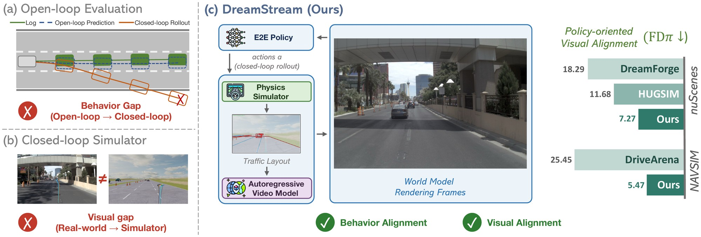

> ## DreamStream: Towards Policy-Oriented Generative Simulation for End-to-End Driving
>
> ### CoRL 2026
>
> ### [[Paper]](https://arxiv.org/abs/2609.26792) [[Project Page]](https://vail-ucla.github.io/DreamStream/)
>
> **[Ziyang Leng](https://matthew-leng.github.io/)**<sup>1,&#42;</sup>,
> **[Sicheng Mo](https://sichengmo.github.io/)**<sup>1,&#42;</sup>,
> [Seth Z. Zhao](https://sethzhao506.github.io/)<sup>1</sup>,
> [Haoyuan Cai](https://haoyuancai.github.io/)<sup>1</sup>,
> [Yu Zeng](https://zengxianyu.github.io/)<sup>2</sup>,
> [Rowan McAllister](https://rowanmcallister.github.io/)<sup>2</sup>,
> [Bolei Zhou](https://boleizhou.github.io/)<sup>1</sup>
>
> <sup>1</sup>University of California, Los Angeles &nbsp;&nbsp; <sup>2</sup>Toyota Research Institute
>
> <sup>&#42;</sup>Equal contribution

<div align="center">



</div>

---

## Code Release

Coming soon.

## Citation

```bibtex
@inproceedings{leng2026dreamstream,
  title     = {{DreamStream: Towards Policy-Oriented Generative Simulation for End-to-End Driving}},
  author    = {Leng, Ziyang and Mo, Sicheng and Zhao, Seth Z. and Cai, Haoyuan and Zeng, Yu and McAllister, Rowan and Zhou, Bolei},
  booktitle = {Conference on Robot Learning (CoRL)},
  year      = {2026}
}
```
